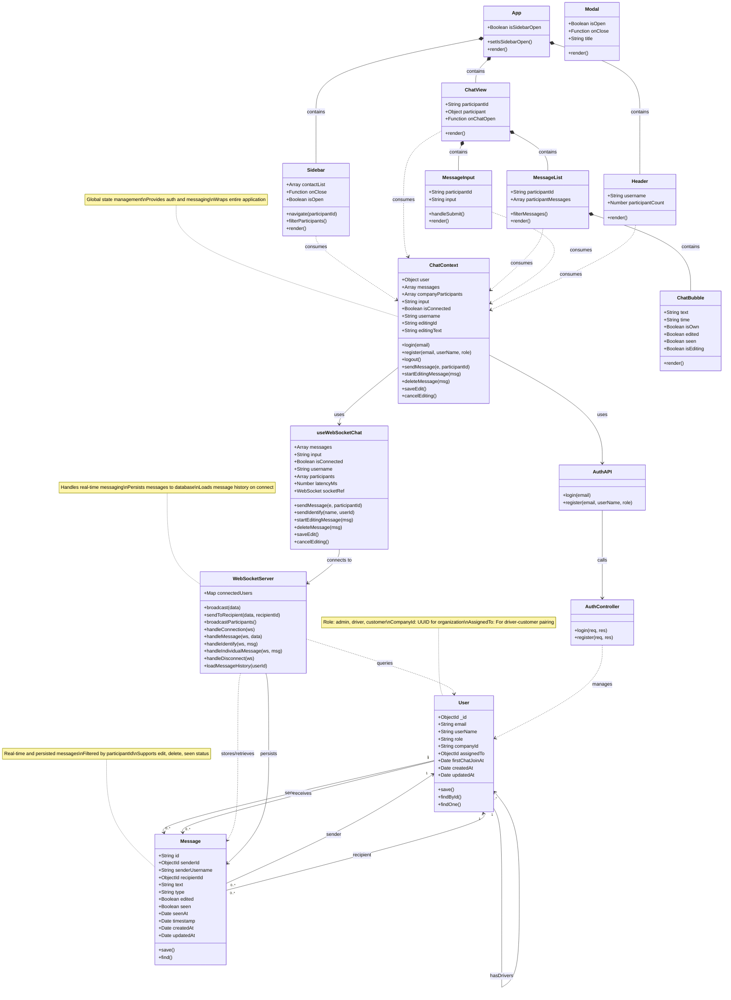

# Chat Application Class Diagram

## Architecture Overview

### Backend Layer
- **Models**: MongoDB schemas for User and Message entities
- **Controllers**: Handle HTTP requests for authentication
- **WebSocket Server**: Manages real-time communication and message persistence
- **Database**: MongoDB with Mongoose ODM

### Frontend Layer
- **Context**: React Context API for global state management
- **Hooks**: Custom hooks for WebSocket and theme management
- **Components**: Reusable UI components
- **Routing**: React Router for individual chat navigation

### Key Features
1. **Individual 1-on-1 Chats**: Route-based conversations using participant IDs
2. **Message Persistence**: All messages stored in MongoDB
3. **Real-time Communication**: WebSocket for instant message delivery
4. **Message History**: Loaded when user connects
5. **Role-based Access**: Admin, driver, and customer roles
6. **Company Organization**: Users grouped by company UUID
7. **Driver-Customer Assignment**: Drivers assigned to specific customers
